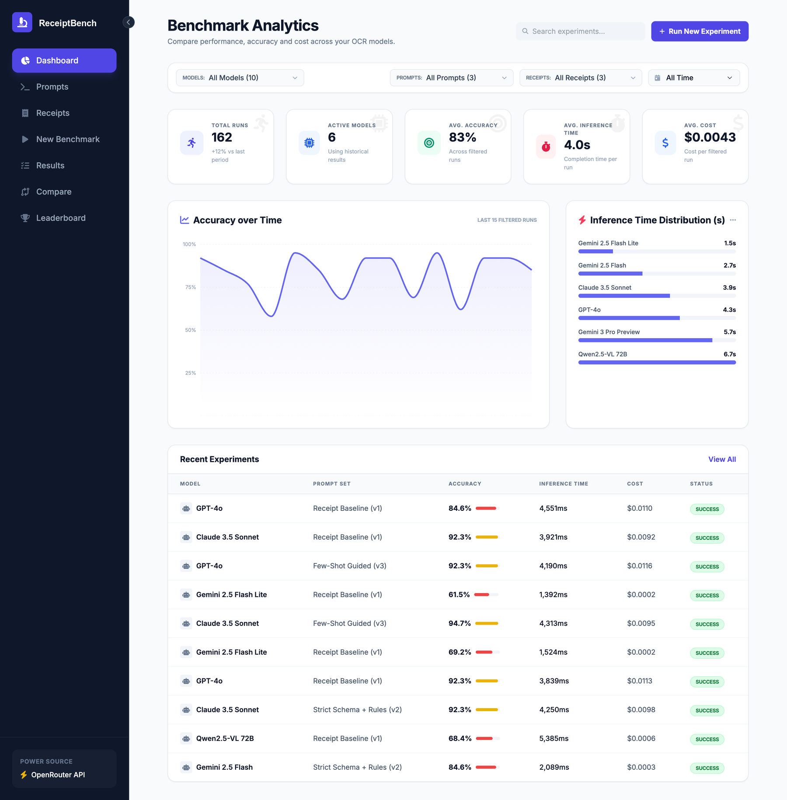
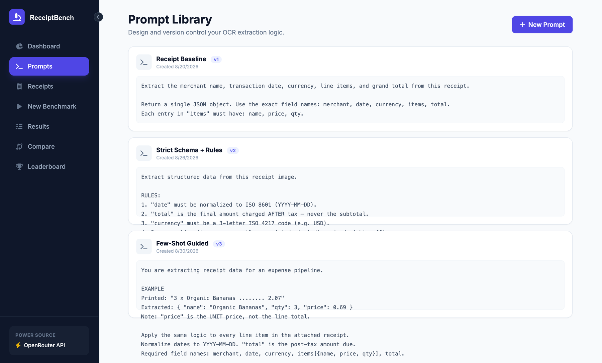
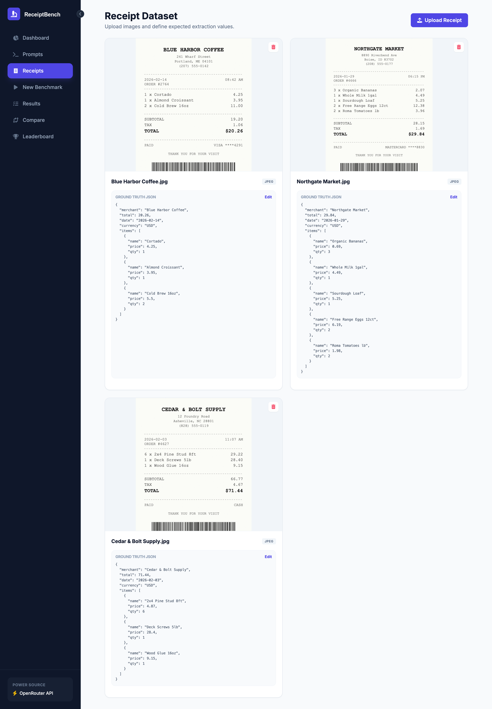
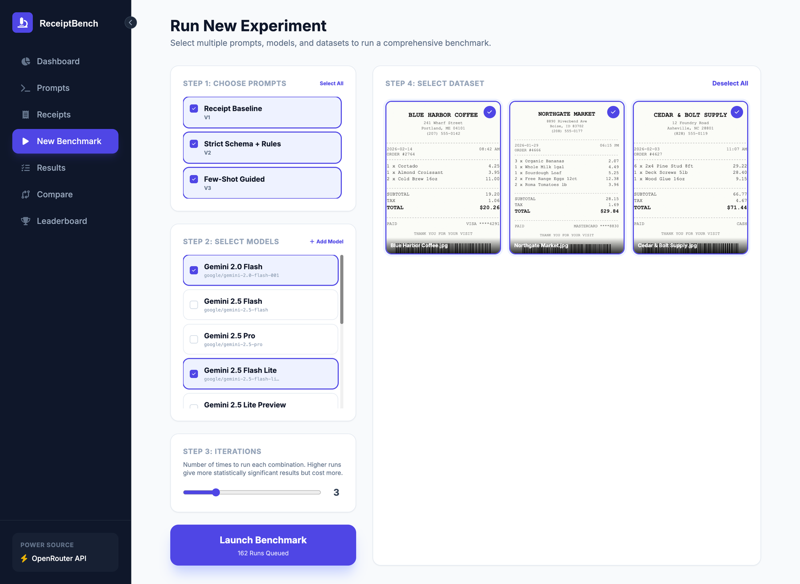
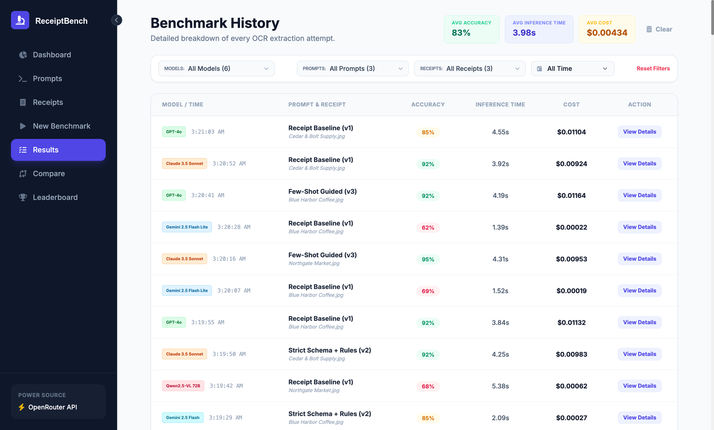
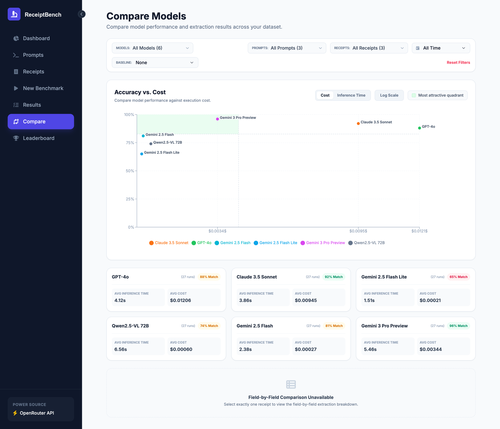
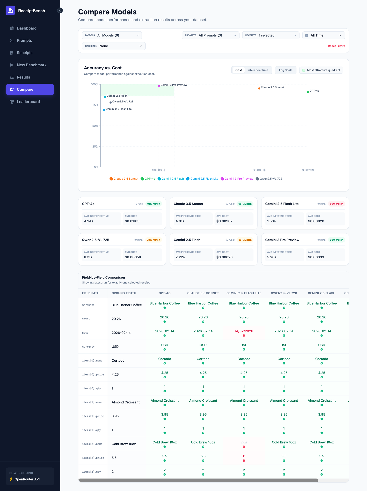
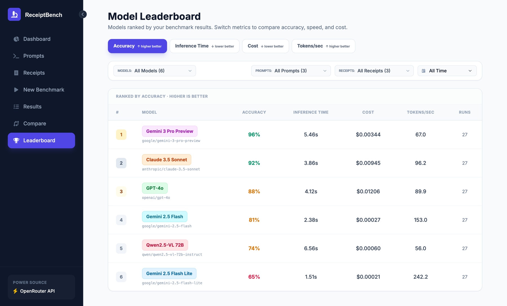

<h1 align="center">ReceiptBench</h1>

<p align="center">
  <strong>A benchmarking harness for OCR pipelines built on vision LLMs.</strong><br>
  Run the same documents through many models and prompt versions, then compare
  accuracy, speed, cost, and throughput side by side.
</p>

<p align="center">
  
  
  
  
</p>

<p align="center">
  
</p>

---

## Why

Picking a vision model for document extraction usually comes down to guesswork:
you try one on a couple of images, it looks fine, and you ship it. But the model
that reads a clean café receipt perfectly may drop line items on a dense grocery
receipt, and the model that's 4% more accurate may cost 50× more per page.

ReceiptBench makes that trade-off measurable. Define your prompts, upload a handful
of documents with the JSON you *expect* to get back, and run the full
cross-product of **prompt × model × document**. You get a per-field accuracy
score for every run, plus the cost and elapsed time it took to get there.

> [!NOTE]
> **Every number in these screenshots is synthetic**, generated by
> [`scripts/seed-demo-data.js`](scripts/seed-demo-data.js) so the UI can be
> demonstrated without burning API credits. They are *not* real measurements —
> benchmark the models yourself before drawing conclusions.

## Features

- **Prompt library** — write and version OCR instructions. Prompts are immutable; saving under an existing name creates the next version, and results reference the prompt that produced them.
- **Ground-truth datasets** — upload document images and pair each with the exact JSON you expect.
- **Batch runner** — queue the full cross-product of prompts × models × documents, with N iterations each. Requests go out in batches of 5.
- **Field-level accuracy** — scoring walks the ground-truth JSON path by path, so you see *which* fields a model got wrong, not just a single percentage. Read [How accuracy is scored](#how-accuracy-is-scored) before trusting the number.
- **Confidence scores** — models are asked to return `{ value, confidence }` per field. Confidence is surfaced in the per-run detail view in **Results**.
- **Cost & token tracking** — token counts come from the API response and are priced from a per-model table.
- **Any OpenRouter model** — nine vision models are preconfigured; add any other OpenRouter model ID from the UI without touching code.
- **Leaderboard & comparison** — rank models by accuracy, speed, cost, or throughput, and diff their raw output against ground truth field by field.
- **Local-only storage** — prompts, results, and custom models in `localStorage`; images in IndexedDB. No backend, no server, no analytics.

## Screenshots

### Prompt library
Version your extraction instructions, so you can prove a prompt change actually helped.



### Ground-truth dataset
Each document is stored with the JSON you expect back. That expected JSON is what accuracy is scored against.



### Batch runner
Pick prompts, models, and documents, set your iteration count, and the runner queues every combination — here 3 prompts × 6 models × 3 receipts × 3 iterations = 162 runs.



### Run history
Every successful attempt, with its accuracy, elapsed time, and cost. Filter by model, prompt, document, or time window.



### Accuracy vs. cost
The trade-off plot. The shaded quadrant marks models scoring above the mean accuracy *and* below the mean cost of the models currently selected — switch the x-axis to elapsed time when speed is what matters.



### Field-by-field comparison
Narrow to one document to see exactly where each model diverged from ground truth. Here one model returned the date as `14/02/2026` instead of ISO `2026-02-14`, dropped a line item entirely, and reported a line total where the unit price was expected.



### Leaderboard
Aggregate ranking across all runs, re-sortable by the metric you actually care about.



## Getting started

**Prerequisites:** Node.js **20.19+** or **22.12+** (required by `@vitejs/plugin-react` 5), and an [OpenRouter](https://openrouter.ai) account.

```bash
git clone https://github.com/trippuroskie/ReceiptBench.git
cd ReceiptBench
npm install

cp .env.example .env.local
# then edit .env.local and set your key from https://openrouter.ai/keys

npm run dev
```

Open <http://localhost:3000>.

### Try it without an API key

To explore the interface with the synthetic dataset used in the screenshots
above, skip the key entirely:

1. `npm run dev`
2. Open the app, then open your browser's devtools console
3. Paste the contents of [`scripts/seed-demo-data.js`](scripts/seed-demo-data.js) and press Enter
4. Reload

To clear it again: `localStorage.clear(); indexedDB.deleteDatabase('ReceiptBenchDB'); location.reload();`

### Your first real benchmark

1. **Prompts** → *New Prompt*. Ask for the fields you need. A JSON envelope requesting `{ value, confidence }` per field is prepended automatically (see `SYSTEM_PROMPT_PREFIX` in `constants.tsx`).
2. **Receipts** → *Upload Receipt*. Add an image, then edit its ground-truth JSON to the values you expect.
3. **New Benchmark** → select prompts, models, and documents, set iterations, and launch.
4. **Results** / **Compare** / **Leaderboard** → read the outcome.

Start with one cheap model and one document to sanity-check your prompt before
queueing a large matrix — a full run is `prompts × models × documents ×
iterations` billable API calls.

## Security

> [!IMPORTANT]
> **Your API key is exposed to the browser. Run ReceiptBench locally only.**

`vite.config.ts` inlines `OPENROUTER_API_KEY` into the client bundle at build
time, and the browser calls the OpenRouter API directly. That is fine for a
local tool, but it means:

- **Never deploy a build of this app to a public URL.** The key would be readable in the JavaScript bundle by anyone who loads the page.
- **The dev server is bound to `localhost` on purpose.** The bundle it serves has the key inlined, so binding all interfaces would hand the key to anyone on your network. If you need LAN access anyway, opt in explicitly with `npm run dev -- --host` and understand what you're exposing.
- **Never commit `.env.local`.** It is gitignored, along with `.env` and every `.env.*` variant except `.env.example`.
- **Use a key with a spend limit.** OpenRouter lets you cap credits per key — do that, and rotate the key if a build artifact ever leaves your machine.
- `npm run build` writes the key into `dist/`. Treat `dist/` as a secret; it is gitignored.

To make this deployable you would need to proxy model calls through a small
server-side endpoint that holds the key and never returns it to the client.
Contributions in that direction are welcome.

## How accuracy is scored

`utils/evaluator.ts` flattens the ground-truth JSON into leaf paths
(`items[0].price`, `total`, …) and, for each one, looks for the corresponding
value in the model's output — first by exact path, then by searching for the
leaf key anywhere in the response, so a model that nests its output differently
isn't punished for shape alone. Values are unwrapped from
`{ value, confidence }`, then compared as case-insensitive trimmed strings.
Accuracy is `matched leaf paths / total leaf paths`.

This is a deliberately strict, deliberately simple metric. Know its limits
before you trust it:

- **No fuzzy matching.** `"Blue Harbor Coffee"` vs `"BLUE HARBOR COFFEE"` matches (case and surrounding whitespace are normalized), but `"Blue Harbor Cafe"` scores zero for that field.
- **No numeric tolerance.** `20.26` vs `20.3` is a miss. Comparison is string-based after `String(...)`, so a numeric `20.3` also misses the string `"20.30"`.
- **Every leaf path is weighted equally.** A wrong `total` costs the same as a wrong `qty` on one line item.
- **Omission and hallucination score the same.** A model that skips a field and one that invents a wrong value both simply fail to match.
- **The leaf-key fallback takes the first match.** For repeated keys like `items[N].price`, if the exact path is missing, the field is scored against the first `price` found anywhere — which can credit a value from the wrong line item.
- **Ground-truth `null` can never match**, because the comparison requires a non-null value. Since the system prompt tells models to return `null` for unreadable fields, datasets with `null` in ground truth cannot reach 100%.
- **Unparseable output scores 0 for the whole run,** not per field. If a model returns malformed JSON, the entire run is a zero.

If you need different semantics, `calculateAccuracy` is a single pure function —
swap it out.

## Known limitations

Worth knowing before you rely on the numbers:

- **Failed runs are dropped, not recorded.** If a request errors, times out (60s), or the provider rejects it, the attempt is logged to the browser console and vanishes — it does not appear in history as a failure or a zero. Only a 402/quota error stops the batch. Check the console if a run count looks short.
- **"Inference time" is client-side wall-clock** around the whole HTTP request, so it includes network latency and provider queueing, not just model inference.
- **Custom models added from the UI use placeholder pricing** (`$0.10/M` in, `$0.40/M` out) because there is no pricing field in the dialog. Their cost figures are therefore not meaningful until you add the model to `MODEL_CONFIGS` with real prices.
- **Cancelling stops the queue, not in-flight requests.** Up to 5 already-dispatched requests will finish, still bill you, and still record results after the UI returns to the config screen.
- **JSON mode is always requested.** `response_format: { type: "json_object" }` is sent unconditionally, so models or providers that don't support it will fail (and be dropped, per above).
- **The "refine prompt" action in Results makes an extra billable call**, hardcoded to `google/gemini-2.0-flash-001`.
- **Two views are unreachable.** `ViewState` includes `models` and `matrix`; `CostAccuracyMatrix` is wired into `App.tsx` but has no sidebar entry, and `models` has neither.
- **Two known TypeScript errors** in `Compare.tsx` and `CostAccuracyMatrix.tsx` — Recharts 3's types reject the `fill` prop on `ReferenceArea`, though it works at runtime. `npm run build` is unaffected (Vite does not typecheck).

## Project structure

```
index.html               Entry document; loads Tailwind, Font Awesome, fonts from CDNs
index.tsx                React entry point
App.tsx                  Root state, batch-run orchestration, persistence
types.ts                 ViewState, BenchmarkResult, Receipt, Prompt, CustomModel
constants.tsx            MODEL_CONFIGS (names + pricing), SYSTEM_PROMPT_PREFIX
vite.config.ts           Dev server, path alias, and the env `define` that inlines the key
tsconfig.json            TypeScript config
metadata.json            PWA manifest
services/openrouter.ts   OpenRouter client: runOCR(), refinePrompt()
utils/evaluator.ts       calculateAccuracy() and JSON path helpers
components/
  Sidebar.tsx            Navigation
  Dashboard.tsx          Aggregate metrics and trends
  PromptManager.tsx      Prompt versioning
  ReceiptManager.tsx     Image upload and ground-truth editing
  BenchmarkRunner.tsx    Run configuration
  ResultsHistory.tsx     Per-run history, confidence detail, prompt refinement
  Compare.tsx            Accuracy-vs-cost plot, field-by-field diff
  Leaderboard.tsx        Aggregate model ranking
  CostAccuracyMatrix.tsx Cost/accuracy matrix (no sidebar entry — unreachable)
scripts/
  seed-demo-data.js      Synthetic demo dataset for the screenshots above
```

See [AGENTS.md](AGENTS.md) for conventions, including how to add a model or a view.

## Data & privacy

Your data stays in your browser. Prompts, results, and custom model configs go
to `localStorage`; document images and their base64 data go to IndexedDB. There
is no backend and no analytics.

Two things do leave your machine:

- **Document images**, sent to OpenRouter, which routes them to the model provider you selected — along with an `HTTP-Referer: http://localhost:3000` and `X-Title: ReceiptBench` attribution header. Don't benchmark documents containing information you aren't willing to send to a third party, and check the retention policy of the providers you route to.
- **Static assets.** `index.html` loads Tailwind, Font Awesome, and Google Fonts from public CDNs on every page load, so those CDNs see your IP and user agent. Vendor them locally if that matters to you.

## Adding a model

Any OpenRouter model works without a code change — **New Benchmark → Add
Model** and paste the model ID. Custom models are saved to `localStorage`. Note
that they get placeholder pricing (see [Known limitations](#known-limitations)).

To add a model to the built-in list with correct pricing, add a config to
`MODEL_CONFIGS` in `constants.tsx`. By convention you also add the ID to
`ModelIdValues` in `types.ts` and reference it from there — `ModelId` is just
`string`, so this is for readability rather than type safety. Prices are stored
per-token (per-million divided by 1,000,000), so keep them current with
[OpenRouter's pricing](https://openrouter.ai/models).

## Contributing

Issues and pull requests are welcome — see [CONTRIBUTING.md](CONTRIBUTING.md).
The most valuable change would be a server-side proxy for the API key.

## License

[MIT](LICENSE)
